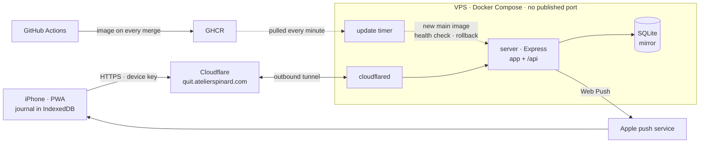

# quit

A personal PWA for one smoke-free journey under a self-managed nicotine patch taper: it works
offline on the phone, and a small server keeps a mirror of its journal.

[](https://github.com/Maximespinard/quit/actions/workflows/ci.yml)

<p align="center">
  
  
  
  
</p>

## What it does

- **Craving timer**: one tap starts it, the craving is logged when it ends.
- **Patch taper**: a protocol of steps, today's patch and a calendar of the ones applied.
- **Streak and money saved**, stats on cravings, every fact listed, export and import.

## Key decisions

**State is derived, never stored** ([ADR-0002](docs/adr/0002-state-derived-from-a-journal-of-facts.md)).
The journal holds facts (the quit moment, patch applications, cravings, lapses) and a few
settings (the protocol, the weekly spend). Streak, money saved and stats are never persisted:
they are pure functions of `(journal, now)`, recomputed on demand. Facts can be backdated, edited,
deleted or imported, and stored totals would drift on each of those; derived values cannot.
The cost is recomputing from the whole journal each time, which a single person's journal makes
cheap, and a changed rule rewrites the past (accepted). `now` is always a parameter: ESLint rejects
`Date.now()` and `new Date()` in domain modules.

**The device is the reference; the server only mirrors it** ([ADR-0003](docs/adr/0003-device-first-journal-mirrored-to-the-server.md)).
A craving is logged one-handed, often without signal, so the journal lives in IndexedDB and
the app never waits on the network. Each change becomes a pending change, replayed to the
server as an idempotent `PUT` or `DELETE` of one fact (ids made on the device) until it is
acknowledged. The server stores it in relational SQLite tables and checks shapes, never domain
rules. Trade-offs: iOS gives a PWA no Background Sync API, so pending changes leave only while
the app is open; the mirror is only as fresh as the last time the app reached the server; the
data sits on the server in clear.

**One contract for both sides.** `contract/` holds zod schemas (the `zod/mini` build) for the
facts, the settings, the journal file and every API body. The app and the server import the
same module and infer the types of those shapes from it, never write them by hand, so a shape
change fails the typecheck on whichever side it breaks. `zod/mini` over full zod: a smaller
bundle on the phone, for a functional, wordier API.

**No accounts: one device key.** There is one user with one phone. The maintainer issues a key
on the server and pastes it into the app once. The server keeps only its SHA-256 hash, compares
it in constant time, and rate-limits failed attempts; the key carries 256 bits of randomness.
Issuing a new key revokes the old one, which covers a lost phone: new key, then a restore from
the mirror. Sign-up, passwords, sessions and recovery flows would add surface without a second
user to serve. The limit is deliberate: one active device at a time.

## Architecture



The phone runs React 19, TanStack Router, Tailwind v4 and vite-plugin-pwa; the server runs
Express 5 and SQLite through Drizzle on Node 24. npm workspaces: the app at the root,
`contract/`, `server/`.

## Code structure

```
contract/src/          zod schemas shared by app and server; imports only zod
src/
├── shared/            domain (pure functions of journal and now), storage, ui, hooks
├── features/<name>/   one bounded context each: craving, patch, calendar, stats, mirror, …
└── routes/            TanStack Router file routes: wire features together, no domain logic
server/src/
├── db/                Drizzle schema and SQLite connection
├── auth/              device keys
├── mirror/            the mirror's routes and storage
└── push/              push subscriptions and the sender
e2e/                   Playwright specs
```

Imports flow one way, `shared → features → routes`: `shared` imports only itself, a feature
imports `shared` and itself, never another feature. ESLint's boundaries rule
([`eslint.config.js`](eslint.config.js)) fails the lint on any other import. `contract/` sits
below all of it.

## Quality

- **TypeScript fully strict** in the app, the server and the contract (`strict`,
  `noUncheckedIndexedAccess`, `exactOptionalPropertyTypes`); `any` is a lint error.
- **Domain tests read "facts in, state out"**: a journal and an injected `now` go in, the
  derived state is asserted. The same named scenarios feed the tests and the in-app sandbox.
- **Playwright on WebKit at iPhone 16 Pro size**, against the production build and the real
  server. The offline spec runs in Chromium, since Playwright's WebKit blocks requests the
  service worker would answer.
- **CI** runs three jobs side by side: the verify gate; the full e2e suite, then the Docker
  image built and the smoke and offline specs run against the container, checked not to run as
  root; a leak scan. On `main`, the image is published only when all three pass.
- **`npm run verify`** (lint, typecheck, tests, build, then each workspace's own verify) is the
  local gate before each commit; CI enforces it before each merge.
- **gitleaks** scans staged changes in the pre-commit hook and the pushed commits in CI.

## Production

A Cloudflare Tunnel dials out from the VPS: the app publishes no port. A timer pulls the image
CI publishes on every merge to `main`, and a release that fails its health check is rolled back
by itself. Details: [`docs/deploy.md`](docs/deploy.md).

## Run it locally

```bash
npm install
npm run dev           # Vite on :3000; the app runs without the server, /api goes to :8080
npm run verify        # the gate: lint, typecheck, tests, build, every workspace
npm run test:e2e      # Playwright against the preview build, the API started beside it
npm run screenshots   # regenerates the screenshots above from sandbox scenarios
git config core.hooksPath .githooks   # once per clone: gitleaks on every commit
```

## Docs

- [`CONTEXT.md`](CONTEXT.md): the domain glossary, binding in code and UI copy
- [`PRODUCT.md`](PRODUCT.md): who it is for and what it must do
- [`DESIGN.md`](DESIGN.md): the visual system
- [`docs/adr/`](docs/adr/): architecture decisions
- [`docs/api.md`](docs/api.md): the server's HTTP contract
- [`docs/deploy.md`](docs/deploy.md): production, the image and the server's configuration
- [`CLAUDE.md`](CLAUDE.md): conventions for coding agents

## License

MIT, see [`LICENSE`](LICENSE).
