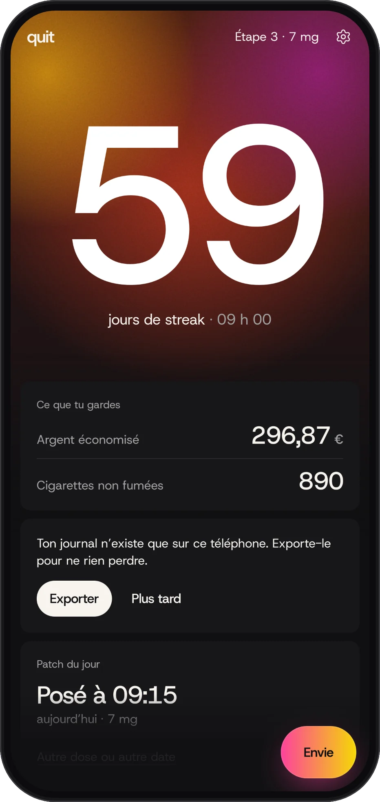
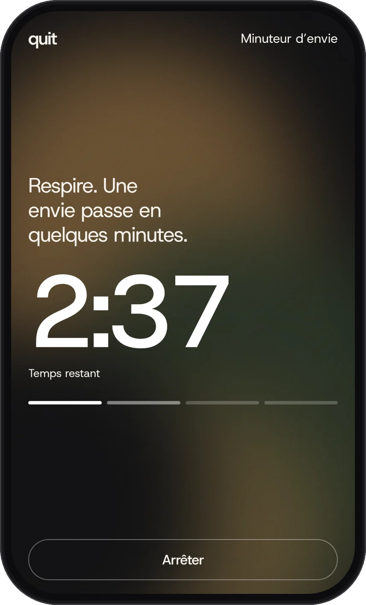
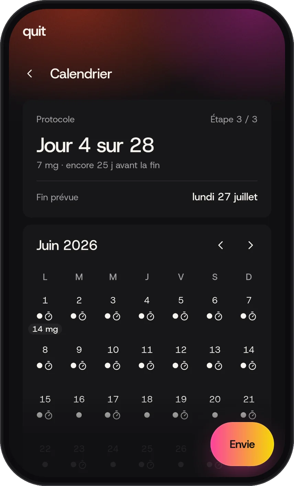
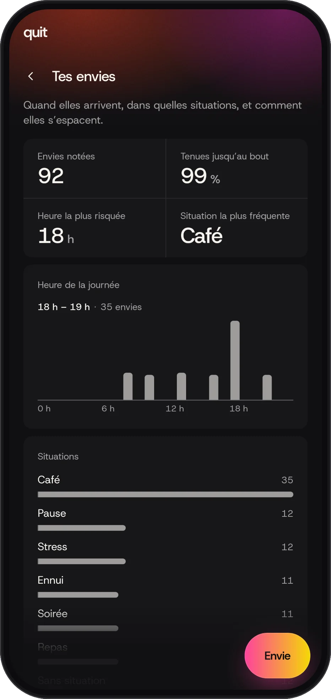
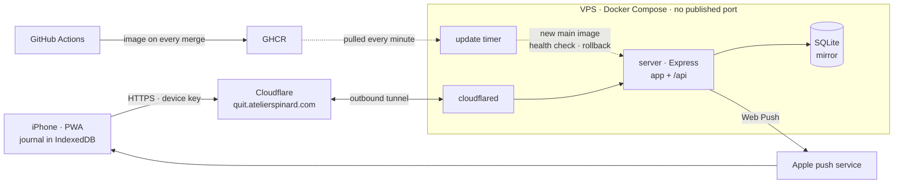

# quit

[](https://github.com/Maximespinard/quit/actions/workflows/ci.yml)

Personal PWA tracking one smoke-free journey under a self-managed nicotine patch taper.
Device-first: the journal lives on the phone and works offline; a small server keeps a mirror
of it and sends the push notifications. No accounts: one device, linked by its key.

- **Craving timer**: one tap starts it, the craving is logged when it ends.
- **Patch taper**: a protocol of steps, today's patch and a calendar of the ones applied.
- **Streak and money saved**, stats on cravings, a history of every fact, export and import.

<p align="center">
  
  
  
  
</p>

## Architecture



- **State is derived, never stored**: the device records facts (a craving, a patch, a lapse);
  streak, savings and stats are pure functions of the journal and the time (`docs/adr/0002`).
- **The device is the reference**: every change is queued on the phone and mirrored to the
  server one at a time, so the app never waits on the network (`docs/adr/0003`).
- **One contract**: zod schemas in `contract/` type the facts, the journal file and every API
  body, on both sides.

## Getting started

```bash
npm install
npm run dev
```

The repository is npm workspaces, installed together by one `npm install` at the root:

| Workspace | What it holds |
| --- | --- |
| root | The PWA: React 19, TanStack Router, Tailwind v4, vite-plugin-pwa |
| `contract/` | Zod schemas of the facts, the settings, the journal file and the API bodies; their types are inferred from them |
| `server/` | The API server and Web Push sender: Express 5, SQLite through Drizzle (see [Server](#server)) |

Install the git hooks once per clone (gitleaks scan on every commit):

```bash
git config core.hooksPath .githooks
```

The same hook also rejects a commit whose staged changes match a regex in
`.git/info/banned-words` — a local, never-committed list of wording that is out of scope here.

## Scripts

| Script | What it does |
| --- | --- |
| `npm run dev` | Vite dev server on port 3000 |
| `npm run verify` | lint + typecheck + tests + build, then every workspace's own verify — the gate before any commit |
| `npm run test` | Vitest once (`test:watch` to watch) |
| `npm run test:e2e` | Playwright suite (WebKit, iPhone) against the production preview build, or against `E2E_BASE_URL` when set |
| `npm run build` | Production build (typecheck included) |
| `npm run lint:fix` | Biome autofix + ESLint fix |
| `npm run screenshots` | Builds, then renders the screenshots above into `docs/screenshots/`: demo scenarios, clock stopped, WebKit at iPhone 16 Pro size, phone frame drawn in code |

## Server

`server/` runs its TypeScript sources directly on Node ≥ 24, no build step. SQLite (WAL) lives
in `DATA_DIR`; pending migrations from `server/drizzle/` are applied at start. Its HTTP
contract (mirror, device key, push) is in [`docs/api.md`](docs/api.md).

```bash
cd server
DATA_DIR=./data npm start                # or: node --env-file=.env src/main.ts (see .env.example)
npm run verify                           # lint · typecheck · tests
npm run db:generate -- --name <change>   # after editing src/db/schema.ts: writes the next migration
```

| Variable | Default | |
| --- | --- | --- |
| `DATA_DIR` | — (required) | Directory of the database file `quit.db`, created when missing |
| `VAPID_PUBLIC_KEY` | — (required) | VAPID key pair (`npx web-push generate-vapid-keys`); the public key is the app's `applicationServerKey` |
| `VAPID_PRIVATE_KEY` | — (required) | |
| `VAPID_SUBJECT` | — (required) | `mailto:` or `https://` contact for the push services (Apple rejects anything else) |
| `PORT` | `8080` | |
| `LOG_LEVEL` | `info` | pino level; logs are JSON lines on stdout, never a body, a query nor a header |
| `TRUST_PROXY` | `0` | Reverse proxies in front, e.g. `1` behind the tunnel, so the rate limit counts per client |
| `APP_DIR` | — (API only) | The built PWA (`dist/`) to serve outside `/api` |

A missing or invalid variable stops the start with a message naming it.

## Image

One image holds the built app and the server that serves it (`Dockerfile`, built from the
root). It runs as `node`, not root, with the database on the `/data` volume. CI builds it on
every pull request and runs the smoke and offline e2e specs against the container; on `main`
it publishes `ghcr.io/maximespinard/quit` tagged with the commit sha and `main`.

```bash
docker build -t quit .
docker run --rm --name quit -p 8080:8080 -v quit-data:/data \
  -e VAPID_PUBLIC_KEY=… -e VAPID_PRIVATE_KEY=… -e VAPID_SUBJECT=mailto:… quit   # the app on http://localhost:8080
docker exec quit node src/issue-device-key.ts   # the device key, same DATA_DIR
E2E_BASE_URL=http://127.0.0.1:8080 npm run test:e2e -- smoke.spec.ts offline.spec.ts
```

## Deploy

The image runs on a VPS behind a Cloudflare Tunnel: no inbound port, secrets kept on the host.
A merge to `main` goes live about two minutes after CI publishes its image, and a release that
fails its health check is rolled back by itself. Install, operations and rollback: [`docs/deploy.md`](docs/deploy.md).

## Docs

- `CONTEXT.md` — the domain glossary; the words used in code and UI copy
- `docs/adr/` — architecture decisions
- `docs/api.md` — the server's HTTP contract
- `docs/deploy.md` — production: how it runs, first install, operations
- `CLAUDE.md` — conventions for agents working in this repo

## License

MIT — see `LICENSE`.
