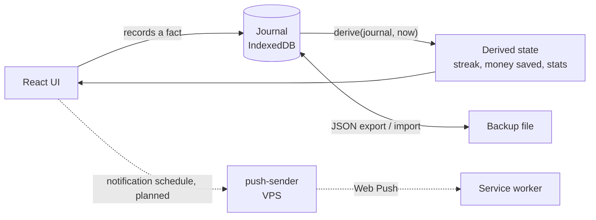

# quit

[](https://github.com/Maximespinard/quit/actions/workflows/ci.yml)
[](LICENSE)

A local-first PWA that tracks one smoke-free journey under a self-managed nicotine patch taper.

Built for one person on one iPhone, installed to the home screen and used offline. Every figure
on screen is derived from facts the user recorded. Nothing lives on a server and there are no
accounts. The UI is in French.

> `quit` is a working name.

<!-- Screenshots: take them in demo mode once it ships, never from real data. -->

## What it does

- **Quit moment and streak.** Record when you stopped, backdated if needed. The streak counts up
  live from there.
- **Protocol.** A patch taper you define: 21 → 14 → 7 mg, four weeks each, by default. Dose and
  duration of every step are editable, and the app never changes them on its own.
- **Patch applications.** Log today's patch in one tap. The application site is suggested,
  switchable, and never the same as the previous one.
- **Patch calendar.** Steps, patch applications, lapses and cravings on one calendar.
- **Craving timer.** One gesture from the home screen. Intensity from 1 to 3, optional tags once
  the timer ends.
- **Lapses.** A slip costs its smoke-free day and its cigarettes, nothing else. Three calendar
  days in a row with a lapse make a relapse, which restarts the streak. The count of smoke-free
  days never resets.
- **History.** Review, edit or delete any fact.
- **Money saved.** Computed from the weekly tobacco spend, next to cigarettes not smoked and a
  goal to save towards.
- **Craving stats.** By hour of day, tag and intensity, and over time.
- **Backup.** Export and import the journal as JSON, with a periodic reminder to export.
- **Offline.** Installable on iOS, fully precached, no network needed after the first load.

## Principles

1. **The craving moment wins.** When needs conflict on screen, the person mid-craving with one
   free hand comes first.
2. **Facts in, state out.** The app shows only what the journal proves.
3. **A lapse is recorded, not judged.** Its cost is clear and announced before it lands. It never
   erases what was earned.
4. **The protocol belongs to the user.** The app follows the taper the user defined.
5. **Quiet by default.** No accounts, no social features, no ads, no re-engagement.

## Architecture

**Local-first** ([ADR-0001](docs/adr/0001-local-first-data-with-a-dumb-push-sender.md)). The
journal lives in IndexedDB on the device, and JSON export is the only backup. There is no data
backend, no sync and no account. iOS web push still needs a server, so a small push sender
([`push-sender/`](push-sender/README.md)) receives a ready-made schedule of notifications from the
app and sends each one when due. It knows nothing about the domain.

**Derived from a journal of facts**
([ADR-0002](docs/adr/0002-state-derived-from-a-journal-of-facts.md)). Only facts and settings are
stored: the quit moment, patch applications, cravings, lapses, the protocol, the weekly spend, the
goal. Streak, smoke-free days, money saved and stats are never persisted. One pure function,
`derive(journal, now)`, computes them on demand. Backdating, editing, deleting or importing facts
cannot leave a stale total behind, and a rule change re-scores the whole journal.

**The clock is an input.** Domain code never reads the system clock: `now` is always a
parameter, and an ESLint rule bans `Date.now()` and `new Date()` there.

**One list of scenarios.** [`scenarios.ts`](src/shared/domain/scenarios.ts) names precise
situations of the app, each a journal plus a value of `now`. The domain tests and the debug panel
read that one list, and demo mode will too.

**One-way imports.** `shared → features → routes`. A feature imports `shared` and itself, nothing
else. `eslint-plugin-boundaries` enforces it.



## Tech stack

| Layer       | Tools                                                                                            |
| ----------- | ------------------------------------------------------------------------------------------------ |
| App         | React 19, TypeScript 6 strict (`noUncheckedIndexedAccess`, `exactOptionalPropertyTypes`), Vite 8 |
| Routing     | TanStack Router, file-based, SPA                                                                 |
| UI          | Tailwind CSS v4, Base UI, Lucide                                                                 |
| Storage     | IndexedDB through `idb`                                                                          |
| PWA         | vite-plugin-pwa (Workbox `generateSW`, auto-update)                                              |
| Quality     | Biome v2, ESLint (boundaries and clock ban), Vitest, Testing Library, Playwright                 |
| Push sender | Node 24+ running TypeScript directly, Hono, `web-push`, Docker                                   |

## Getting started

Requirements: Node 20+ (CI runs 22), npm, and [gitleaks](https://github.com/gitleaks/gitleaks)
for the commit hook.

```bash
npm install
npm run dev          # http://localhost:3000
```

Install the git hooks once per clone:

```bash
git config core.hooksPath .githooks
```

The pre-commit hook runs gitleaks on staged changes. It also rejects a commit whose staged
changes match a regex in `.git/info/banned-words`, a local, never-committed list of wording that
is out of scope here.

### On an iPhone

A service worker needs HTTPS. Serve a production build (`npm run build`, output in `dist/`) over
HTTPS, open it in Safari, then Share → Add to Home Screen. The app launches standalone and works
offline from then on.

## Scripts

| Script               | What it does                                                          |
| -------------------- | --------------------------------------------------------------------- |
| `npm run dev`        | Vite dev server on port 3000                                          |
| `npm run verify`     | Lint, typecheck, tests, build: the gate before every commit           |
| `npm run test`       | Vitest once (`test:watch` to watch)                                   |
| `npm run test:e2e`   | Playwright against the production preview build                      |
| `npm run build`      | Production build, typecheck included                                  |
| `npm run preview`    | Serve the production build locally                                    |
| `npm run typecheck`  | `tsc -b`                                                              |
| `npm run lint:fix`   | Biome autofix, then ESLint fix                                        |
| `npm run format`     | Biome format                                                          |

## Testing

- **Unit and domain.** Vitest and Testing Library on jsdom, tests colocated with the code. Domain
  tests read as facts in, state out, with concrete data. The suite pins `TZ=Europe/Paris` so
  daylight-saving cases test what they claim on any machine.
- **End to end.** Playwright against the production preview build, real bundle and service
  worker, on WebKit at iPhone 16 Pro size. The offline spec runs in Chromium, because Playwright's
  WebKit blocks every request once offline, even those the service worker answers. Two suites at
  once need their own ports: `E2E_PORT=4174 npm run test:e2e`.
- **CI.** GitHub Actions on every pull request and on `main`: `verify`, `e2e`, and the push
  sender's own lint, tests and Docker build.

## Sandbox and debug panel

The debug panel ships in production, hidden. A long press on the brand, or `?debug=true`, opens it
on a sandbox: a throwaway journal, empty at the start, with a clock that can be moved at will. The
real journal is never read or written, and the sandbox is gone on reload.

- `?debug=true&scenario=<id>` seeds the sandbox from a scenario (ids in
  [`scenarios.ts`](src/shared/domain/scenarios.ts)).
- `?debug=true&clock=<ms>` stops the sandbox clock at that instant. The e2e suite uses it.

Facts can be injected and time moved, but nothing grants a level or a badge directly. The only
way to reach a state is a journal and a clock that produce it.

## Project layout

```
src/
├── routes/              # file-based routes: wiring only, no domain logic
├── features/<feature>/  # one bounded context: components, hooks, utils
├── shared/              # imports shared only
│   ├── domain/          # facts, journal, derive(journal, now), scenarios
│   ├── storage/         # IndexedDB journal store
│   └── ui/  hooks/  utils/
└── routeTree.gen.ts     # generated by the router plugin, never edited by hand
e2e/                     # Playwright specs
push-sender/             # the push sender, a separate package
docs/adr/                # architecture decisions
docs/research/           # sourced health facts, default step durations
```

Features: `backup`, `calendar`, `craving`, `debug`, `history`, `lapse`, `patch`, `protocol`,
`savings`, `setup`, `stats`, `streak`. No barrel files: imports point at the real module.

## Roadmap

- [x] **M1 Core**: quit moment, streak, protocol, patch applications, calendar, cravings, lapses,
      history, export and import, offline PWA, debug panel
- [ ] **M2 Motivation**
  - [x] Money saved, cigarettes not smoked, goal
  - [x] Craving stats
  - [x] A sourced health fact for each time badge
  - [ ] XP, streak multiplier and levels
  - [ ] Badges
  - [ ] Daily check-in
  - [ ] Encouragements
  - [ ] Demo mode
- [ ] **M3 Online**
  - [x] Push sender service
  - [ ] Deploy to a VPS
  - [ ] Push reminders: daily patch, step changes, badges, encouragements

## Documentation

- [`CONTEXT.md`](CONTEXT.md): the domain glossary. Code and UI copy use its words.
- [`docs/adr/`](docs/adr/): architecture decisions.
- [`PRODUCT.md`](PRODUCT.md): users, purpose, principles, scope.
- [`DESIGN.md`](DESIGN.md): the design system.
- [`docs/research/`](docs/research/): sourced health facts per time badge, default step durations
  from patch notices.
- [`push-sender/README.md`](push-sender/README.md): the sender's contract and send loop.
- [`CLAUDE.md`](CLAUDE.md): conventions for coding agents working in this repo.

## Disclaimer

`quit` is a personal tool, not medical advice. The patch taper is set by the user: talk to a
doctor or pharmacist about nicotine replacement.

## License

MIT, see [`LICENSE`](LICENSE).
